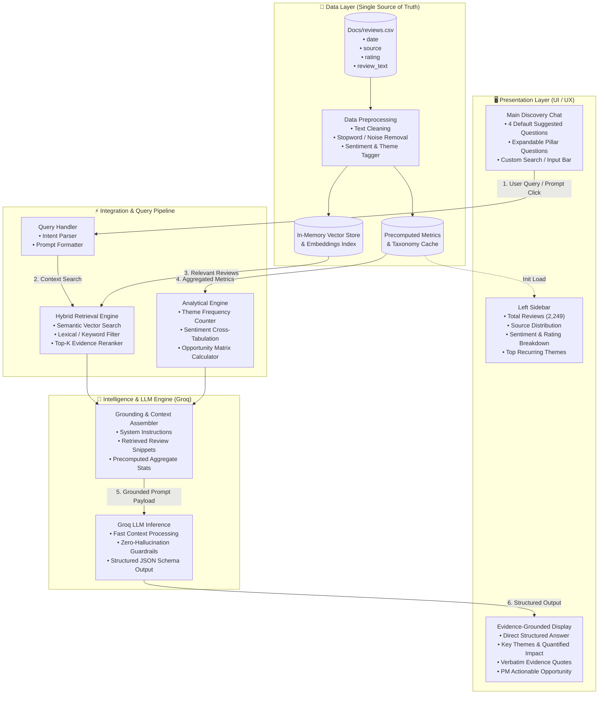
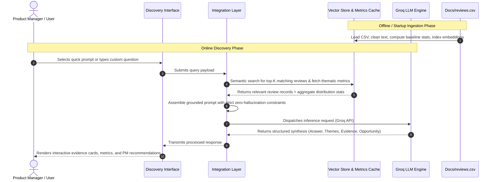

# Myntra Review & Discovery Engine — System Architecture

## 1. System Overview

The **Myntra Review & Discovery Engine** is an AI-powered conversational analytics system designed to uncover the friction points between customer wishlist intent and actual purchase conversions. 

The system processes a dedicated dataset of customer reviews (`Docs/reviews.csv`), extracts multi-dimensional thematic and sentiment insights, retrieves relevant evidence via Retrieval-Augmented Generation (RAG), and uses high-speed LLM inference (powered by Groq) to synthesize actionable product recommendations for Product Managers.

---

## 2. High-Level Architecture Diagram



---

## 3. End-to-End System Workflow

The system operates across **5 discrete stages**:



---

## 4. Architectural Layers & Subsystems

### 4.1. Data Ingestion & Preprocessing Subsystem
- **Source**: Exclusively reads `Docs/reviews.csv` (2,249 reviews across Google Play Store, Apple App Store, and Reddit).
- **Text Normalization**:
  - Cleans emojis, excess whitespaces, and noise while preserving sentiment-bearing expressions.
  - Generates tokenized representations for search indexing.
- **Thematic Tagging**:
  - Maps review text against 12 core thematic clusters (Fit & Size, Price/Discounts, Product Quality, Return/Exchange Anxiety, Social Validation, etc.).
- **Baseline Aggregation**:
  - Precomputes source counts, rating averages, sentiment distribution, and theme frequencies on system launch to ensure instantaneous sidebar rendering.

### 4.2. Vector Storage & Hybrid Retrieval Engine
- **In-Memory Embedding Index**:
  - Encodes review texts into dense vector embeddings for semantic similarity search.
- **Hybrid Retrieval Strategy**:
  - Combines **dense semantic search** (for conceptual queries like *"hesitations before buying"*) with **sparse keyword filtering** (for targeted terms like *"size chart"*, *"refund delay"*, *"AJIO"*).
- **Top-K Reranking**:
  - Dynamically extracts the top 15–30 most relevant reviews per query to construct an information-dense context window without context dilution.

### 4.3. Intelligence & Recommendation Engine (Groq)
- **High-Speed Inference**:
  - Uses Groq's high-throughput LPU-powered inference to ensure near-instantaneous query response times.
- **Grounded Prompt Construction**:
  - Prompts are dynamically assembled with three distinct context partitions:
    1. **System Persona & Constraints**: Strict directive to only use facts from the provided context.
    2. **Aggregated Metrics Slice**: Precomputed percentages and frequencies for quantitative grounding.
    3. **Verbatim Evidence Slice**: Exact review excerpts tagged with date, source, and rating.
- **Zero-Hallucination Guardrail**:
  - Explicit instruction prevents the model from speculating when dataset evidence is sparse or absent (e.g., demographic segments not captured in the CSV).

### 4.4. Presentation Layer (UI / UX)
- **Left Sidebar (Dataset Overview Dashboard)**:
  - Total volume, average rating, positive/neutral/negative sentiment shares.
  - Interactive platform breakdown (Play Store, App Store, Reddit).
  - Top thematic distribution with exact percentages.
- **Main Chat & Discovery Interface**:
  - Quick-start cards for the **4 primary suggested prompts**:
    - *Why do users wishlist products but not buy them?*
    - *What are the biggest purchase barriers?*
    - *What uncertainties do users have before purchasing?*
    - *What are the biggest conversion opportunities?*
  - Expandable modal/drawer for the **10 Strategic Pillar Questions**.
  - Interactive free-text input box.
- **Structured Response Components**:
  - **Executive Summary**: Direct 2–3 sentence answer.
  - **Key Thematic Drivers**: Tagged themes with quantified impact.
  - **Supporting Evidence Accordion**: Verbatim review quotes citing date, source, and rating.
  - **Opportunity & PM Action Plan**: Concrete feature or product interventions to boost wishlist-to-purchase conversion.

---

## 5. Data Flow & Schemas

### 5.1. Input Review Schema (`Docs/reviews.csv`)

| Field Name | Type | Description | Example |
| :--- | :--- | :--- | :--- |
| `date` | `ISO8601 String` | Timestamp of review submission | `2026-08-21T20:45:21` |
| `source` | `String` | Originating review platform | `playstore`, `appstore`, `reddit` |
| `rating` | `Integer` | Customer rating (1 to 5) | `1`, `4`, `5` |
| `review_text` | `String` | Raw customer review feedback | `"material and fitting is good 👍"` |

### 5.2. Opportunity Prioritization Scoring Matrix

The engine evaluates conversion opportunities using a multi-factor matrix rather than raw mention count:

$$\text{Priority Score} = \text{Theme Frequency (\%)} \times \text{User Pain Weight (Negative Sentiment Ratio)} \times \text{Wishlist Barrier Impact}$$

*Where:*
- **Frequency**: Percentage of reviews touching the theme.
- **Pain Weight**: Ratio of 1-star/2-star ratings within that theme.
- **Barrier Impact**: High weight for direct blockers (size ambiguity, return friction, misleading images) vs. low weight for passive mentions.

### 5.3. LLM Response Payload Schema (Structured JSON)

```json
{
  "direct_answer": "Users primarily abandon wishlisted items due to sizing uncertainty and return policy anxiety...",
  "identified_themes": [
    {
      "name": "Fit & Size Uncertainty",
      "frequency_pct": 34.2,
      "sentiment_breakdown": { "positive": 18, "neutral": 12, "negative": 70 },
      "severity": "High"
    },
    {
      "name": "Price & Discount Waiting",
      "frequency_pct": 28.5,
      "sentiment_breakdown": { "positive": 45, "neutral": 35, "negative": 20 },
      "severity": "Medium"
    }
  ],
  "evidence_quotes": [
    {
      "quote": "I kept 3 dresses in wishlist for a month because size charts are totally misleading across different brands.",
      "source": "App Store",
      "rating": 2,
      "theme": "Fit & Size Uncertainty"
    }
  ],
  "opportunity_analysis": {
    "primary_barrier": "Lack of standardized brand sizing and user body-type photos.",
    "conversion_impact_score": 8.8,
    "recommended_actions": [
      "Implement personalized size & fit predictor based on past successful orders.",
      "Incentivize customer photo reviews with height/weight/size metadata."
    ]
  }
}
```

---

## 6. Security, Reliability & Performance Guardrails

1. **Single Source of Truth**: Only data from `Docs/reviews.csv` is ingested. No third-party or mock review datasets are accessed.
2. **Deterministic Precomputations**: Baseline metrics (ratings, sentiment splits, theme counts) are computed deterministically during ingestion to prevent LLM numerical drift.
3. **Graceful Segment Fallbacks**: When user segmentation data (e.g., specific age groups or micro-demographics) is absent in the CSV, the system explicitly states that the dataset lacks sufficient metadata rather than estimating.
4. **Latency Target**: Sub-second to 2-second roundtrip response times leveraging Groq's low-latency inference.
