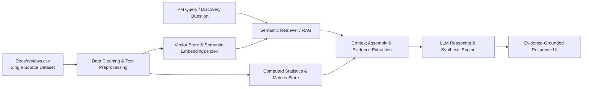

# Myntra Review & Discovery Engine — Project Context & Specification

## 1. Executive Summary & Business Context

- **Platform**: Myntra (Fashion E-Commerce)
- **Core Problem**: Users actively browse fashion catalog items and save them to their **Wishlist** (signaling strong initial purchase interest), but a significant portion of these wishlisted items never convert into completed transactions.
- **Primary Business Goal**: **Increase the percentage of users who purchase at least one wishlisted item within 30 days of adding it to their wishlist.**
- **Strategic Need**: Analyze the official dataset of customer feedback in `Docs/reviews.csv` (covering App Store, Play Store, and community reviews) to identify behavioral barriers, customer friction points, information gaps, and psychological hesitations that stall wishlist conversion.

---

## 2. Dedicated Single-Source Dataset (`Docs/reviews.csv`)

> [!IMPORTANT]
> **Single Source of Truth**: The AI Engine and all analysis pipelines strictly use **only** the attached reviews dataset located at `Docs/reviews.csv`. All external/unattached datasets have been removed.

- **File Path**: `Docs/reviews.csv`
- **Data Schema**:
  - `date`: Timestamp of review submission (covering historical to current reviews).
  - `source`: Platform source (`App Store`, `Play Store`, `Reddit`).
  - `rating`: Customer satisfaction rating on a 1–5 scale.
  - `review_text`: Full verbatim user feedback covering wishlist usage, sizing/fit doubts, return policies, delivery, pricing, and comparison behaviors.

---

## 3. Key Research Questions (The 10 Pillars)

The AI Discovery Engine must systematically address the following 10 strategic questions using evidence retrieved from `Docs/reviews.csv`:

1. **Wishlist Motivation**: Why do users add fashion products to their wishlist in the first place?
2. **Purchase Barriers**: What prevents wishlisted products from eventually being purchased?
3. **Post-Selection Uncertainty**: What hesitations/doubts remain after a user has found a product they like?
4. **Postponement Drivers**: What triggers users to delay or postpone purchase decisions?
5. **Product Comparison Dynamics**: How do users evaluate and compare multiple shortlisted products?
6. **External Information Seeking**: What details do users seek on external channels (e.g., YouTube, Instagram, Reddit, AJIO) before committing?
7. **Decision Factors**: What roles do **fit & size, styling, pricing, reviews, occasion, and social validation** play in closing a sale?
8. **Intent vs. Bookmarking**: When is the wishlist treated as genuine buying intent versus an aspirational bookmarking / "save-for-later" bucket?
9. **Segment Variation**: How do wishlist and hesitation behaviors differ across user segments (gender, price sensitivity, purchase frequency)?
10. **Unmet Needs**: What recurring unmet customer desires and platform gaps emerge across user dialogues?

---

## 4. Required Analytical Modules

### 4.1. Theme Analysis
Automatically extract, classify, and quantify recurring topics across `Docs/reviews.csv`:
- **Price & Discounts**: Price drop expectations, coupon validity, perceived value, surge pricing.
- **Fit & Size Uncertainty**: Sizing chart reliability, body-type suitability, inconsistent brand sizing.
- **Product Quality & Fabric**: Material transparency, wash durability, color fidelity vs. photos.
- **Reviews & Ratings Reliability**: Fake reviews, lack of customer photos, sparse feedback for new items.
- **Styling & Outfit Compatibility**: "How to style", matching items, wardrobe compatibility.
- **Occasion-Based Purchasing**: Impending events (weddings, festivals, vacations) driving timelines.
- **Social Validation**: Peer feedback, influencer references, trend validation.
- **Return & Exchange Anxiety**: Return friction, pickup delays, refund timelines, exchange availability.
- **Product Comparison**: Cross-brand or cross-platform (e.g., AJIO vs. Myntra) price/quality comparisons.
- **Stock & Availability**: Out-of-stock sizes, slow restock alerts.
- **Wishlist as Bookmarking**: Aesthetic hoarding, style inspiration without immediate buying intention.
- **Information Deficit**: Missing fabric blend info, care instructions, exact dimension guides.

*Each theme must report exact review counts and percentage shares from `Docs/reviews.csv`.*

### 4.2. Sentiment Analysis
- Multi-class classification: **Positive**, **Neutral**, **Negative**.
- Direct cross-tabulation with themes to pinpoint which friction areas drive negative sentiment and churn.

### 4.3. Opportunity Prioritization Engine
Rank and evaluate conversion opportunities using a multi-factor matrix:
$$\text{Frequency} \times \text{User Pain Severity} \longrightarrow \text{Potential Wishlist Conversion Impact}$$
- *Guardrail*: Avoid pure frequency-based sorting; moderate-frequency issues with severe abandonment pain (e.g., return friction or size inaccuracy) often hold higher conversion ROI than high-frequency minor cosmetic mentions.

### 4.4. Segment Analysis
- Sub-group comparative insights (e.g., Men vs. Women, frequent vs. occasional buyers, value/discount shoppers vs. premium buyers).
- *Strict Guardrail*: If dataset metadata lacks sufficient demographic/behavioral tags for a specific segment, the engine must explicitly state the limitation rather than fabricate segmentation data.

---

## 5. UI / UX & System Layout

```
+---------------------------------------------------------------------------------------------------+
|  MYNTRA REVIEW & DISCOVERY ENGINE                                             [Status: Connected] |
+-----------------------------------+---------------------------------------------------------------+
| LEFT SIDEBAR: DATASET OVERVIEW    | MAIN DISCOVERY & CHAT INTERFACE                               |
| (Source: Docs/reviews.csv)        |                                                               |
| 📊 Metrics at a Glance            | 💬 Suggested Quick Prompts:                                   |
|   • Total Reviews in Dataset      |   [ Why do users wishlist but not buy?                      ] |
|   • Source Breakdown              |   [ What are the biggest purchase barriers?                 ] |
|   • Rating & Sentiment Splits     |   [ What uncertainties do users have before purchasing?     ] |
|                                   |   [ What are the top conversion opportunities?              ] |
| 🌐 Source Distribution Breakdown   |   [ + More Questions...                                     ] |
|   [ Play Store | App Store | ...] | ------------------------------------------------------------- |
|                                   | 🤖 Conversational AI Engine:                                  |
| 🏷️ Top Recurring Themes          |   • Direct Structured Synthesis                               |
|   • Fit & Size                    |   • Key Identified Themes with % Impact                       |
|   • Pricing & Deals               |   • Evidence Cards & Exact Customer Quotes                    |
|   • Return Friction               |   • Quantitative Metrics & Segment Comparisons                |
|   • Quality & Fabric              |   • Actionable Product Opportunity & PM Next Steps            |
|                                   | ------------------------------------------------------------- |
|                                   | [ 🔍 Ask any custom question about Myntra reviews...     ] [➤]|
+-----------------------------------+---------------------------------------------------------------+
```

---

## 6. Technical Architecture & RAG Pipeline



### Engineering Constraints:
1. **Zero Hallucination**: Every insight and quoted excerpt must originate directly from `Docs/reviews.csv`.
2. **Single Dataset Architecture**: No external or auxiliary review files are loaded.

---

## 7. System Workflow

The end-to-end system follows a structured 5-stage workflow:

1. **Data Ingestion**:
   - Load the cleaned single-source CSV dataset of Myntra reviews (`Docs/reviews.csv`).
2. **User Input**:
   - User selects predefined/suggested questions or types custom queries into the chat interface.
3. **Integration Layer**:
   - Filters and prepares relevant review data, extracts contextual evidence, and passes the prepared context to the LLM.
4. **Recommendation Engine (Groq)**:
   - Uses LLM (powered by Groq) to analyze evidence, generate explanations, extract recurring themes, and synthesize actionable summaries.
5. **Output Display**:
   - Renders structured outputs, key thematic breakdowns, exact review quotes/evidence, quantitative metrics, and product conversion recommendations.

