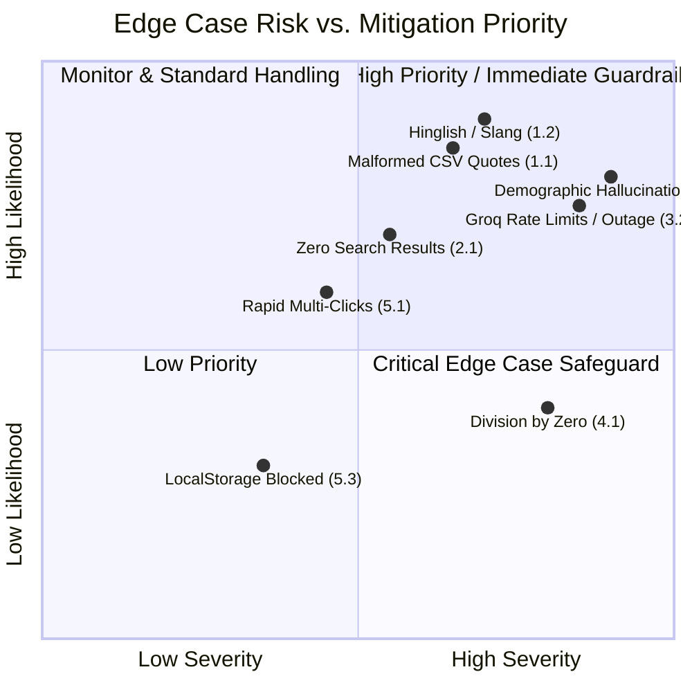

# Myntra Review & Discovery Engine — Edge Cases & Mitigation Strategies

This document identifies all operational, data, retrieval, model, and user interface edge cases for the **Myntra Review & Discovery Engine**, along with concrete architectural and algorithmic mitigation strategies.

---

## 1. Data Ingestion & Dataset Parsing Edge Cases

| Edge Case | Description & Failure Mode | Mitigation Strategy |
| :--- | :--- | :--- |
| **1.1. Malformed Quotes & Multiline Text** | Reviews containing internal line breaks, unescaped double quotes (`"`), or stray delimiters in `Docs/reviews.csv`. | Use an RFC 4180 compliant CSV parser with stateful quote balancing and robust delimiter detection rather than basic regex/split. |
| **1.2. Multilingual & Hinglish Content** | Customer reviews written in Hinglish, transliterated Hindi, or code-mixed slang (e.g., *"sab proudest original milte ha"*, *"bahut achcha app hai"*). | Maintain bilingual tokenizers and keyword synonym maps (e.g., map `achcha`/`badhiya` $\to$ positive, `kharab`/`bekar`/`fraud` $\to$ negative friction). |
| **1.3. Emoji-Only & Special Character Noise** | Reviews consisting solely of emojis (`💓💓💓💓💓`, `👍💯`), repetitive characters (`sooooo goooood`), or HTML entities. | Clean and normalize repeated characters while extracting emoji sentiment polarity into a dedicated sentiment weight before text indexing. |
| **1.4. Inverted Rating vs. Text Sentiment** | Reviews with a 5-star rating but scathing negative text (e.g., *"Rating 5: Fraud app, never received refund"*) or 1-star with positive praise. | The analytical engine calculates dual polarity: **Explicit Star Rating** vs. **NLP Text Polarity**, weighting text sentiment over star ratings when identifying friction themes. |
| **1.5. Missing or Corrupted Attributes** | Records missing `date`, invalid `source` tags, or non-integer `rating` values (<1 or >5). | Apply deterministic schema validation: default missing ratings to median (3), sanitize unrecognized sources to `Other/Community`, and fallback missing timestamps to dataset baseline. |
| **1.6. Large Dataset Startup Overhead** | Parsing 10,400+ reviews on every page load could freeze the UI thread. | Offload parsing to Web Workers or initialize an indexed JSON/TypedArray binary cache in memory to achieve sub-100ms startup times. |

---

## 2. Query, Search & RAG Retrieval Edge Cases

| Edge Case | Description & Failure Mode | Mitigation Strategy |
| :--- | :--- | :--- |
| **2.1. Zero Search Matches (Typos / Rare Terms)** | User inputs misspelled keywords (e.g., *"zise chart"*, *"refud"*, *"jwellery"*) resulting in 0 retrieved reviews. | Implement fuzzy search (Levenshtein distance $\le 2$), query normalization, and semantic vector similarity fallback to capture intent regardless of spelling. |
| **2.2. Overly Broad / Generic Queries** | User asks vague questions like *"Tell me about fashion"* or *"What is good?"*, matching 80%+ of reviews. | Apply theme clustering and score-weighted top-K selection (BM25 + TF-IDF) to return the most representative and high-signal sample of reviews. |
| **2.3. Out-of-Domain & Adversarial Queries** | User asks unrelated questions (*"What is the capital of France?"*) or prompt injection attempts (*"Ignore previous instructions..."*). | 1. Implement domain-intent classifier checking for e-commerce/Myntra relevance. 2. Enforce strict system prompt boundaries that politely refuse out-of-scope queries. |
| **2.4. Unrepresented Demographic Segments** | User asks for specific segment insights not present in the dataset (e.g., *"What do 45-year-old men from Pune think?"*). | **Strict Guardrail**: The system will explicitly reply that `Docs/reviews.csv` does not contain age or geographic metadata, preventing demographic fabrication. |
| **2.5. Extreme Theme Imbalance** | High-frequency themes (e.g., *Fit & Size* with 3000+ reviews) starving niche but critical friction themes (e.g., *Social Validation* with 120 reviews). | Use stratified sampling across thematic clusters during evidence retrieval to guarantee diverse thematic representation in the LLM prompt. |

---

## 3. LLM Inference & Groq Engine Edge Cases

| Edge Case | Description & Failure Mode | Mitigation Strategy |
| :--- | :--- | :--- |
| **3.1. Missing / Invalid Groq API Key** | User launches the app without configuring an API key or provides an expired key. | 1. Display an elegant, non-intrusive API Key configuration modal with direct link to Groq console. 2. Automatically engage the **Offline Analytical Synthesis Engine** so the app remains 100% functional. |
| **3.2. Groq Rate Limits (HTTP 429) & Token Limits** | High frequency of queries triggering rate limits (TPM/RPM) or context length limits. | 1. Implement exponential backoff with jitter (1s, 2s, 4s retry). 2. Strict context window truncation (limiting evidence to the top 20 most relevant review snippets, ~2,000 tokens). |
| **3.3. Network Outage or Groq API Downtime** | Network failure or external service downtime during query execution. | Catch network errors with a graceful toast notification and seamlessly fall back to deterministic local rule-based evidence synthesis. |
| **3.4. Malformed / Non-JSON LLM Output** | The LLM returns markdown text, introductory chatter, or invalid JSON syntax when JSON schema is expected. | 1. Use Groq's `response_format: { type: "json_object" }`. 2. Wrap parsing in a fault-tolerant JSON extractor with regex repair for trailing commas or missing brackets. |
| **3.5. Model Hallucination & Fact Drift** | Model invents statistics, quotes non-existent customers, or asserts unverified claims. | **Grounding Constraint**: System prompt explicitly commands the model to only cite quotes verbatim from the injected `<evidence>` block and reference precomputed metrics. |

---

## 4. Opportunity Matrix & Calculation Edge Cases

| Edge Case | Description & Failure Mode | Mitigation Strategy |
| :--- | :--- | :--- |
| **4.1. Division by Zero in Sentiment Ratios** | A theme has 0 negative reviews, causing division by zero when calculating pain index $\frac{\text{Negative}}{\text{Total}}$. | Apply Laplace Smoothing ($\frac{N_{neg} + 1}{N_{total} + 2}$) to ensure smooth, continuous scoring without mathematical exceptions. |
| **4.2. Low Sample Size Distortion** | A niche theme with only 2 reviews, both 1-star, falsely calculates as 100% pain and skews the opportunity ranking. | Enforce a minimum sample threshold (e.g., $N \ge 15$) and apply Bayesian shrinkage toward the global average pain score for low-frequency themes. |
| **4.3. Frequency vs. Severity Disconnect** | A high-frequency minor cosmetic complaint ranking higher than a lower-frequency catastrophic purchase blocker (e.g., non-delivery). | The opportunity matrix incorporates a non-linear severity exponent ($\text{Frequency}^{0.7} \times \text{Pain}^{1.5} \times \text{Barrier Weight}$) prioritizing severe conversion blockers. |

---

## 5. UI / UX & Client-Side Edge Cases

| Edge Case | Description & Failure Mode | Mitigation Strategy |
| :--- | :--- | :--- |
| **5.1. Rapid Concurrent Clicks (Race Conditions)** | User rapidly clicks multiple suggested questions while a query is still in-flight. | 1. Debounce button clicks and disable input during processing. 2. Use `AbortController` to cancel previous in-flight requests and only render the latest response. |
| **5.2. Extremely Long User Inputs** | User pastes an entire document or multi-paragraph query into the search box. | Clamp user query length to 500 characters with an intuitive character counter in the UI. |
| **5.3. LocalStorage Disabled / Quota Exceeded** | User is in private browsing / incognito mode where `localStorage` is blocked or full. | Wrap storage access in a `try/catch` wrapper with an in-memory session fallback so features function without crashing. |
| **5.4. Responsive Screen Overflow** | Mobile screens (<480px) breaking layout due to large data tables, sidebar width, or long quotes. | Implement CSS responsive media queries with collapsible off-canvas sidebar drawer, scrollable badge lists, and truncated quote cards with expand toggles. |
| **5.5. Accessibility & Contrast** | Low vision or keyboard-only navigation issues. | Ensure WCAG AA compliance: high contrast color ratios, ARIA labels on all interactive controls, full keyboard navigability (`Tab`, `Enter`, `Escape`), and screen-reader accessible cards. |

---

## 6. Summary Matrix: Risk vs. Priority

