# Phase-Wise Implementation Plan: Myntra Review & Discovery Engine

Build a high-performance, AI-powered **Review & Discovery Engine** to analyze customer reviews in `Docs/reviews.csv`, uncover friction points preventing wishlisted items from converting to purchases, and provide evidence-grounded insights for Product Managers.

---

## User Review Required

> [!IMPORTANT]
> **API Key & Execution Environment**:
> - The application will include a secure, client-side configuration setting for the **Groq API Key** (with browser `localStorage` persistence) so users can seamlessly run live LLM queries.
> - A high-fidelity built-in analytical fallback engine will also be included to guarantee instant deterministic analysis and review retrieval even if an API key is not yet configured.

---

## Proposed Phases & Milestones

```mermaid
gantt
    title Myntra Review & Discovery Engine Implementation
    dateFormat  X
    axisFormat %d
    section Phase 1
    Data Parsing & Preprocessing       :p1_1, 0, 1
    Deterministic Metrics Computation  :p1_2, 1, 2
    section Phase 2
    Hybrid Search & RAG Indexing       :p2_1, 2, 3
    Context Assembly & Evidence Extraction :p2_2, 3, 4
    section Phase 3
    Groq LLM Engine & Prompt Template  :p3_1, 4, 5
    Zero-Hallucination Guardrails      :p3_2, 5, 6
    section Phase 4
    Modern Design System & Styling     :p4_1, 6, 7
    Sidebar & Discovery Chat UI        :p4_2, 7, 8
    Structured Response Cards          :p4_3, 8, 9
    section Phase 5
    End-to-End Verification & Testing  :p5_1, 9, 10
```

---

### Phase 1: Data Ingestion, Cleaning & Deterministic Metrics Pipeline

**Goal**: Ingest `Docs/reviews.csv` (10,400+ reviews), normalize data, tag recurring themes, and compute baseline statistics.

#### Key Deliverables:
- **CSV Ingestion Module**:
  - Parse headers (`date`, `source`, `rating`, `review_text`).
  - Text normalization: strip extra whitespaces, handle encoding, sanitize noise.
- **12-Theme Taxonomy Classifier**:
  - Classify reviews into:
    1. *Fit & Size Uncertainty*
    2. *Price & Discounts*
    3. *Product Quality & Fabric*
    4. *Reviews & Ratings Reliability*
    5. *Styling & Outfit Compatibility*
    6. *Occasion-Based Purchasing*
    7. *Social Validation*
    8. *Return & Exchange Anxiety*
    9. *Product Comparison (e.g. Myntra vs AJIO)*
    10. *Stock & Availability*
    11. *Wishlist as Bookmarking*
    12. *Information Deficit*
- **Deterministic Baseline Aggregations**:
  - Calculate total review counts, source breakdown (`playstore`, `appstore`, `reddit`), rating average, sentiment distribution (Positive: 4–5★, Neutral: 3★, Negative: 1–2★), and theme frequency counts.

---

### Phase 2: Hybrid RAG Retrieval Engine & Context Extraction

**Goal**: Build a low-latency hybrid search engine combining semantic matching and keyword filtering.

#### Key Deliverables:
- **Search Indexer**:
  - Inverted keyword index with BM25/TF-IDF scoring for direct thematic matches (e.g., *"size chart"*, *"refund"*, *"discount"*).
  - Semantic vector similarity scoring over normalized review tokens.
- **Top-$K$ Evidence Extractor**:
  - Dynamically retrieve the top 15–30 most relevant verbatim review excerpts per user question.
  - Attach full metadata to each retrieved quote (`source`, `rating`, `date`, `matched_theme`).
- **Context Payload Assembler**:
  - Pack precomputed dataset stats + top retrieved reviews into an evidence context block for LLM synthesis.

---

### Phase 3: Groq LLM Inference & Synthesis Engine

**Goal**: Integrate Groq API for rapid LLM reasoning with structured JSON responses and zero-hallucination guardrails.

#### Key Deliverables:
- **Groq API Client**:
  - Fast inference via Groq endpoints (e.g., `llama-3.3-70b-versatile` / `mixtral-8x7b-32768`).
  - Secure API key manager with UI prompt and local persistence.
- **Prompt Engineering & Schema Enforcement**:
  - System prompt enforcing strict grounding: *"Only make claims backed by the supplied review excerpts and computed dataset metrics. Do not fabricate user segments."*
  - Structured output parsing:
    - **Direct Answer** (Executive PM summary).
    - **Identified Themes** (with frequency % and sentiment breakdown).
    - **Verbatim Evidence Quotes** (exact customer citations with source & rating).
    - **Opportunity Prioritization Score** ($\text{Frequency} \times \text{User Pain} \to \text{Impact}$).
    - **Actionable PM Recommendations** (targeted platform & feature interventions).
- **Graceful Fallback Mode**:
  - Instant offline analytical synthesis when operating without a live API key.

---

### Phase 4: UI/UX Presentation Layer & Interactive Dashboard

**Goal**: Develop a modern, responsive web application matching the design specifications.

#### Key Deliverables:
- **Design System & CSS Styling (`index.css`)**:
  - Modern aesthetic: Sleek dark/light palette, crisp typography (Inter / Plus Jakarta Sans), micro-animations, glassmorphic card borders, responsive layout.
- **Left Sidebar Component (Dataset Overview)**:
  - **Metrics at a Glance**: Total reviews counter, average rating star badge, sentiment distribution pills.
  - **Source Breakdown**: Distribution visualizer (Google Play Store | Apple App Store | Reddit) with interactive filters.
  - **Theme Distribution**: Ranked list of top recurring themes with counts and % progress bars.
- **Main Chat & Discovery Area (`app.js` / `index.html`)**:
  - **4 Default Suggested Prompt Cards**:
    1. *Why do users wishlist products but not buy them?*
    2. *What are the biggest purchase barriers?*
    3. *What uncertainties do users have before purchasing?*
    4. *What are the biggest conversion opportunities?*
  - **Expandable 10-Pillar Drawer**: Access all 10 core strategic discovery questions with 1-click.
  - **Custom Search Bar**: Free-form text input with instant keyboard shortcuts (`Enter`, `Esc`).
- **Rich AI Response Renderer**:
  - Collapsible evidence quote accordions with badge tags (`Play Store 1★`, `App Store 2★`).
  - Opportunity matrix badge showing conversion impact score.
  - Copy answer & export insight actions.

---

### Phase 5: Verification, Validation & Walkthrough

**Goal**: Validate data accuracy, RAG retrieval precision, and UI responsiveness.

#### Key Deliverables:
- **Verification of 10 Pillar Questions**:
  - Test all 10 strategic questions against the review dataset to confirm answers are fully grounded.
- **UI Responsiveness & Performance**:
  - Test desktop, tablet, and mobile viewport adaptability.
  - Ensure instant sidebar load and sub-second retrieval times.
- **Documentation & Walkthrough**:
  - Generate complete `walkthrough.md` with features, testing results, and user guide.

---

## Verification Plan

### Automated & Structural Verification
- Check CSV parsing integrity (10,400+ rows parsed without data loss).
- Verify sentiment & theme classification distribution against raw totals.
- Verify JSON response parser error handling.

### Interactive Browser Verification
- Launch and test the web app in browser.
- Verify left sidebar metrics match dataset aggregations.
- Test clicking all 4 suggested questions and expanding 10 pillar questions.
- Test custom question submission and verify evidence quotes citations.
